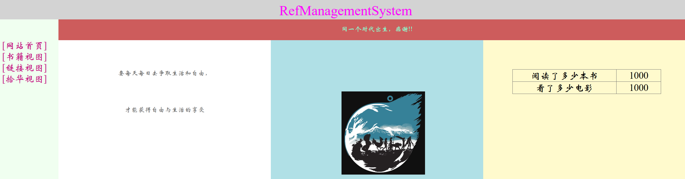
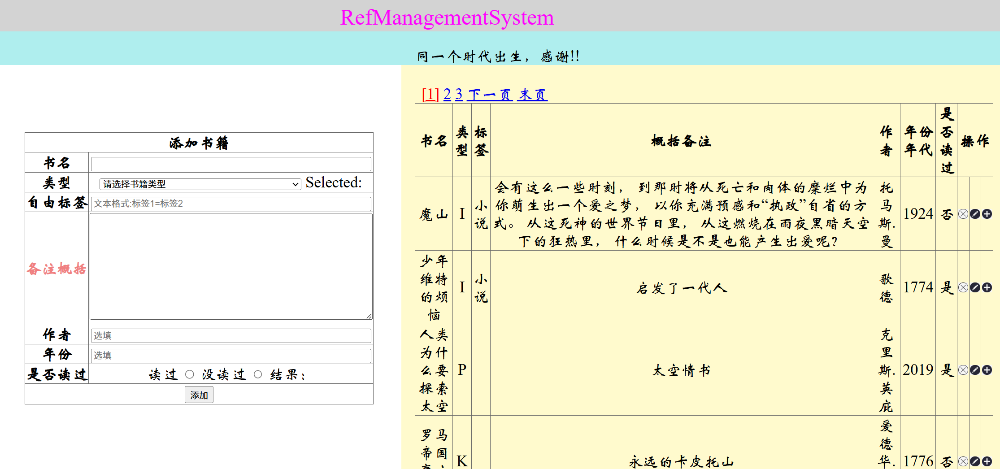
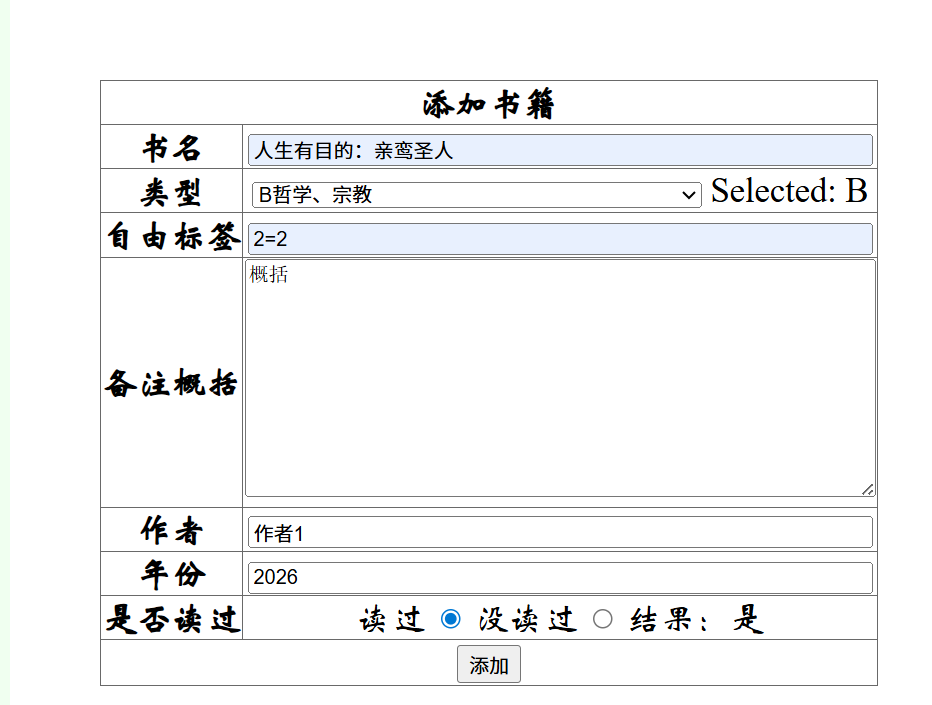
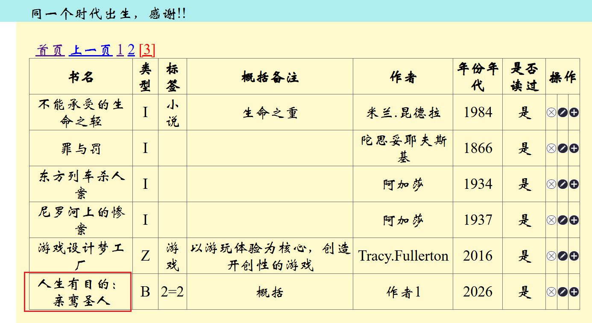
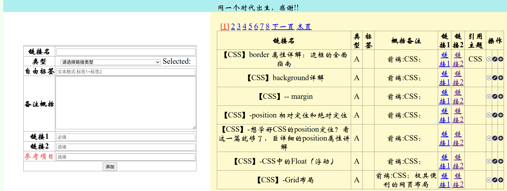
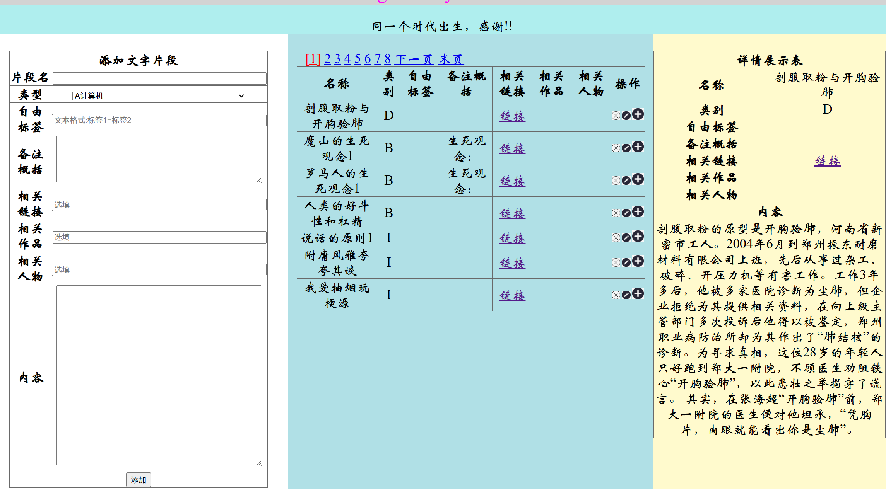
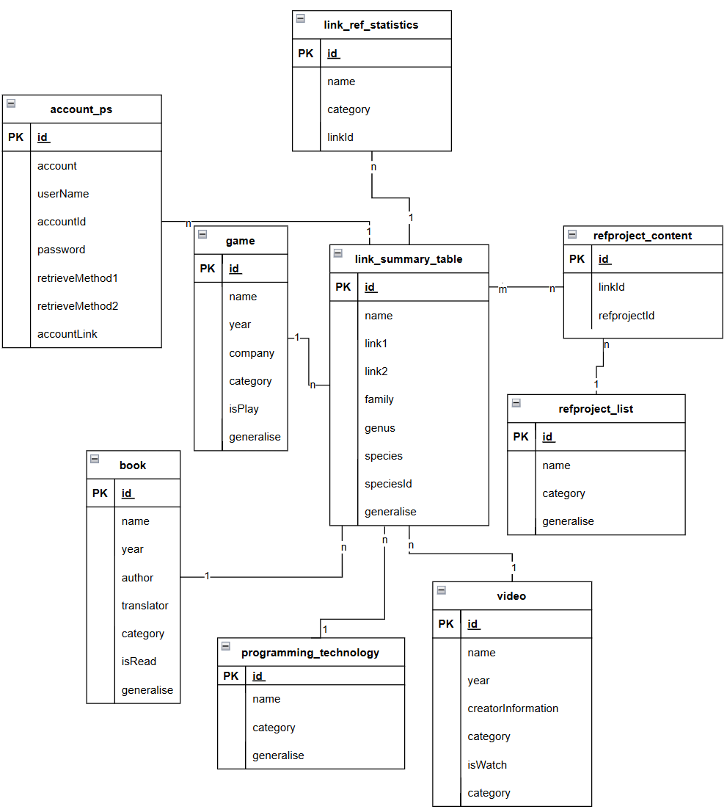

```bash

```

# 简介

主要使用了SpringMVC技术、Mysql数据库、Mybatis技术。最初的设想是我自己打开一个网站，能查看和快速检索自己看过、读过或是准备看准备读或是只是了解一点的影剧、书籍、游戏....，或者记录新的关于这些的基本消息。当我有一个很有参考价值的链接，我能合理分类收纳进数据库。能创建一个引索参考工程，将这个项目所需的网页链接都放进去，然后导出成一个文件出来。

当我遇到只言片语有趣的评论和发言，我可以快速记录在这个网站上。

出于种种原因，实现的不怎么样。代码原件有缺失。目前只是记录一下。如果我早点用github，就不会这样凄凄惨惨戚戚，丢一堆代码了。

# 主要效果

登陆界面：


首页：



书籍视图：





链接视图：





拾华视图：



# ER图



# 主要技术栈

前端：

1. html、CSS、JS
2. thymeleaf

后端：

1. SpringMVC
2. Mybatis

数据库：

1. Mysql


实体类

# 表设计说明

**表注册登记清单-table_registration_checklist**

| **列名** | **数据类型** | **长度** | **是否能为空** | **说明** |
| --- | --- | --- | --- | --- |
| id | int |  | no | 主键，自增长 |
| name | varchar | 128 | no | unique，名表 |
| generalise | varchar | 255 | yes | 介绍表的作用 |
| taxonomy | varchar | 64 | yes | 所使用的分类系统类型 |
| table_category | varchar | 8 | no | 表所属类型，比如资源表、功能表之类 |
- 基本信息
    - generalise：登记和记录所在系统里使用的表的基本信息
    - taxonomy：无
    - table_category：功能表

```
CREATE TABLE `testjdbc`.`table_registration_checklist`  (
  `id` int NOT NULL AUTO_INCREMENT,
  `name` varchar(128) NOT NULL,
  `generalise` varchar(255) NULL,
  `taxonomy` varchar(64) NULL,
  `table_category` varchar(8) NOT NULL,
  PRIMARY KEY (`id`)
);
```

**探索涉猎分类法-exploration_taxonomy**

固定内容表

| **列名** | **数据类型** | **长度** | **是否能为空** | **说明** |
| --- | --- | --- | --- | --- |
| id | int |  | no | 主键，自增长 |
| mark_symbol | char | 1 | no | unique，标记名称 |
| class_name | varchar | 32 | no | 大类名称 |
| class_department | varchar | 32 | no | 类部名称 |

```
CREATE TABLE `testjdbc`.`exploration_taxonomy`  (
  `id` int NOT NULL AUTO_INCREMENT,
  `mark_symbol` char(1) NOT NULL unique,
  `class_name` varchar(32) NULL,
  `class_department` varchar(32) NULL,
  PRIMARY KEY (`id`)
);
```

**中图法-ch_lib_method_taxonomy**

固定内容表

| **列名** | **数据类型** | **长度** | **是否能为空** | **说明** |
| --- | --- | --- | --- | --- |
| id | int |  | no | 主键，自增长 |
| mark_symbol | char | 1 | no | unique，标记名称 |
| class_name | varchar | 32 | no | 大类名称 |
| class_department | varchar | 32 | no | 类部名称 |

```
CREATE TABLE `testjdbc`.`ch_lib_method_taxonomy`  (
  `id` int NOT NULL AUTO_INCREMENT,
  `mark_symbol` char(1) NOT NULL unique,
  `class_name` varchar(32) NULL,
  `class_department` varchar(32) NULL,
  PRIMARY KEY (`id`)
);
```

**书籍总汇表-book_summary**

字段秉承原理：通用必有字段+特有必要字段+特有不必要字段

| **列名** | **数据类型** | **长度** | **是否能为空** | **说明** |
| --- | --- | --- | --- | --- |
| id | int |  | no | 主键，自增长 |
| name | varchar | 50 | no | unique |
| category | char | 1 | yes |  |
| label | varchar | 50 | yes | 自由标签 |
| generalise | varchar | 255 | yes | 选填，必须预留改字段 |
| author | varchar | 64 | yes |  |
| year | varchar | 8 | yes |  |
| isRead | char | 1 | yes |  |

```
CREATE TABLE `testjdbc`.`book_summary `  (
 id INT PRIMARY KEY auto_increment,
`name` VARCHAR(50) not null unique ,
category CHAR(1) ,
    label varchar(50),
generalise VARCHAR(255),
author VARCHAR(64) ,
`year` varchar(8),
isRead char(1)
);
```

**链接总汇表-link_summary**

字段秉承原理：通用必有字段+特有必要字段+特有不必要字段

| **列名** | **数据类型** | **长度** | **是否能为空** | **说明** |
| --- | --- | --- | --- | --- |
| id | int |  | no | 主键，自增长 |
| name | varchar | 128 | no | unique |
| category | char | 1 | yes |  |
| label | varchar | 50 | yes | 自由标签 |
| generalise | varchar | 500 | yes | 选填，必须预留改字段 |
| link1 | varchar | 128 | no | 必填 |
| link2 | varchar | 128 | yes | 选填 |
| ref | varchar | 100 | yes | 选填，必须预留改字段，依赖与一条表中数据，作为它相关引用链接 |

```
CREATE TABLE link_summary
(id INT PRIMARY KEY auto_increment,
`name` VARCHAR(128) not null unique ,
category CHAR(1) ,
 label varchar(50),
generalise VARCHAR(500),
link1 VARCHAR(128) not null,
link2 VARCHAR(128),
ref VARCHAR(100)

);
```

**随拾文华总汇表-easy_text_exploration_summary**

| **列名** | **数据类型** | **长度** | **是否能为空** | **说明** |
| --- | --- | --- | --- | --- |
| id | int |  | no | 主键，自增长 |
| name | varchar | 50 | no | unique |
| category | varchar | 32 | yes |  |
| label | varchar | 50 | yes | 自由标签 |
| generalise | varchar | 500 | yes | 选填，必须预留改字段 |
| link | varchar | 128 | no | 选填，必须预留改字段 |
| works | varchar | 100 | yes | 选填，必须预留改字段 |
| personage | varchar | 50 | yes | 选填，必须预留改字段 |
| content | varchar | 2000 | yes | 必填 |

```
CREATE TABLE easy_text_exploration_summary
(id INT PRIMARY KEY auto_increment,
`name` VARCHAR(128) not null unique ,
category CHAR(1) ,
 label varchar(50),
generalise VARCHAR(500),
link VARCHAR(128) ,
works varchar(50),
 personage varchar(50),
content VARCHAR(2000)

);
```

**标签总汇表-label_summary**

| **列名** | **数据类型** | **长度** | **是否能为空** | **说明** |
| --- | --- | --- | --- | --- |
| id | int |  | no | 主键，自增长 |
| name | varchar | 64 | no | unique，标记名称 |

```
CREATE TABLE `testjdbc`.`label_summary`  (
  `id` int NOT NULL AUTO_INCREMENT,
    `name` varchar(64) not null unique,
  PRIMARY KEY (`id`)
);
```

**主题注册总汇表-remarks_theme_summary**

| **列名** | **数据类型** | **长度** | **是否能为空** | **说明** |
| --- | --- | --- | --- | --- |
| id | int |  | no | 主键，自增长 |
| name | varchar | 64 | no | unique，标记名称 |

```
 CREATE TABLE `testjdbc`.`remarks_theme_summary`  (
  `id` int NOT NULL AUTO_INCREMENT,
    `name` varchar(64) not null unique,
  PRIMARY KEY (`id`)
);
```

# spring环境搭建说明

## **1.开发环境**

IDE：idea 2022.2.2

构建工具：maven3.8.8

服务器：tomcat8

Spring版本：5.3.1

Mybatis核心版本：3.5.7

## **2.创建maven工程**

> [https://mvnrepository.com/](https://mvnrepository.com/) 来确定版本
> 

a>添加web模块

b>配置 tomcat 8

c>打包方式：war

d>引入依赖

- 父工程依赖

```
<?xml version="1.0" encoding="UTF-8"?>
<project xmlns="http://maven.apache.org/POM/4.0.0"
         xmlns:xsi="http://www.w3.org/2001/XMLSchema-instance"
         xsi:schemaLocation="http://maven.apache.org/POM/4.0.0 http://maven.apache.org/xsd/maven-4.0.0.xsd">
    <modelVersion>4.0.0</modelVersion>

    <groupId>com.zxy</groupId>
    <artifactId>RefManagementSystem</artifactId>
    <packaging>pom</packaging>
    <version>1.0-SNAPSHOT</version>
    <modules>
        <module>RefManagementSystem-01</module>
    </modules>

    <properties>
        <!--        用这个属性值来统一管理 spring 的版本-->
        <spring.version>5.3.1</spring.version>
        <maven.compiler.source>8</maven.compiler.source>
        <maven.compiler.target>8</maven.compiler.target>
        <project.build.sourceEncoding>UTF-8</project.build.sourceEncoding>
    </properties>

    <dependencies>
        <!--    spring 的基础框架，
                Spring框架使用其核心IOC思想管理服务器中各个组件，
                使用AOP思想面向切面编程，在不改变源码的基础上实现功能增强
                最基本的搭建中，需要通过它来完成每个类的注册。
                AOP 是你想完成什么工程时，再考虑，在搭建基础环境时无需考虑。
                -->
        <dependency>
            <groupId>org.springframework</groupId>
            <artifactId>spring-context</artifactId>
            <version>${spring.version}</version>
        </dependency>
        <dependency>
            <groupId>org.springframework</groupId>
            <artifactId>spring-beans</artifactId>
            <version>${spring.version}</version>
        </dependency>

        <!--springmvc-->
        <dependency>
            <groupId>org.springframework</groupId>
            <artifactId>spring-web</artifactId>
            <version>${spring.version}</version>
        </dependency>
        <dependency>
            <groupId>org.springframework</groupId>
            <artifactId>spring-webmvc</artifactId>
            <version>${spring.version}</version>
        </dependency>
        <dependency>
            <groupId>org.springframework</groupId>
            <artifactId>spring-jdbc</artifactId>
            <version>${spring.version}</version>
        </dependency>
        <dependency>
            <groupId>org.springframework</groupId>
            <artifactId>spring-aspects</artifactId>
            <version>${spring.version}</version>
        </dependency>
        <dependency>
            <groupId>org.springframework</groupId>
            <artifactId>spring-test</artifactId>
            <version>${spring.version}</version>
        </dependency>

        <!-- Mybatis核心 -->
        <dependency>
            <groupId>org.mybatis</groupId>
            <artifactId>mybatis</artifactId>
            <version>3.5.7</version>
        </dependency>
        <!--mybatis和spring的整合包-->
        <dependency>
            <groupId>org.mybatis</groupId>
            <artifactId>mybatis-spring</artifactId>
            <version>2.0.6</version>
        </dependency>
        <!-- 连接池 -->
        <dependency>
            <groupId>com.alibaba</groupId>
            <artifactId>druid</artifactId>
            <version>1.0.9</version>
        </dependency>

        <!-- junit测试 -->
        <dependency>
            <groupId>junit</groupId>
            <artifactId>junit</artifactId>
            <version>4.12</version>
            <scope>test</scope>
        </dependency>

        <!-- MySQL驱动 -->
        <dependency>
            <groupId>mysql</groupId>
            <artifactId>mysql-connector-java</artifactId>
            <version>8.0.16</version>
        </dependency>
        <!-- log4j日志 -->
        <dependency>
            <groupId>log4j</groupId>
            <artifactId>log4j</artifactId>
            <version>1.2.17</version>
        </dependency>
        <!-- https://mvnrepository.com/artifact/com.github.pagehelper/pagehelper -->
        <!--  分页插件-->
        <dependency>
            <groupId>com.github.pagehelper</groupId>
            <artifactId>pagehelper</artifactId>
            <version>5.2.0</version>
        </dependency>

        <!-- 日志 -->
        <dependency>
            <groupId>ch.qos.logback</groupId>
            <artifactId>logback-classic</artifactId>
            <version>1.2.3</version>
        </dependency>

        <!-- ServletAPI -->
        <dependency>
            <groupId>javax.servlet</groupId>
            <artifactId>javax.servlet-api</artifactId>
            <version>3.1.0</version>
            <scope>provided</scope>
        </dependency>
        <dependency>
            <groupId>com.fasterxml.jackson.core</groupId>
            <artifactId>jackson-databind</artifactId>
            <version>2.12.1</version>
        </dependency>
        <dependency>
            <groupId>commons-fileupload</groupId>
            <artifactId>commons-fileupload</artifactId>
            <version>1.3.1</version>
        </dependency>

        <!-- Spring5和Thymeleaf整合包 -->
        <!-- https://mvnrepository.com/artifact/org.thymeleaf/thymeleaf-spring5 -->
        <dependency>
            <groupId>org.thymeleaf</groupId>
            <artifactId>thymeleaf-spring5</artifactId>
            <version>3.0.15.RELEASE</version>
        </dependency>

    </dependencies>

</project>
```

- 子工程依赖

```
<?xml version="1.0" encoding="UTF-8"?>
<project xmlns="http://maven.apache.org/POM/4.0.0"
         xmlns:xsi="http://www.w3.org/2001/XMLSchema-instance"
         xsi:schemaLocation="http://maven.apache.org/POM/4.0.0 http://maven.apache.org/xsd/maven-4.0.0.xsd">
<!--   父工程坐标-->
    <parent>
        <artifactId>RefManagementSystem</artifactId>
        <groupId>com.zxy</groupId>
        <version>1.0-SNAPSHOT</version>
    </parent>
    <modelVersion>4.0.0</modelVersion>

    <artifactId>RefManagementSystem-01</artifactId>
    <packaging>war</packaging>

</project>
```

## **3.配置web.xml**

> 注册SpringMVC的前端控制器DispatcherServlet
> 

在 src\main\webapp\WEB-INF\web.xml 下配置

可通过init-param标签设置SpringMVC配置文件的位置和名称，通过load-on-startup标签设置SpringMVC前端控制器DispatcherServlet的初始化时间

```
<!-- 配置SpringMVC的前端控制器，对浏览器发送的请求统一进行处理 -->
<servlet>
    <servlet-name>springMVC</servlet-name>
    <servlet-class>org.springframework.web.servlet.DispatcherServlet</servlet-class>
    <!-- 通过初始化参数指定SpringMVC配置文件的位置和名称 -->
    <init-param>
        <!-- contextConfigLocation为固定值 -->
        <param-name>contextConfigLocation</param-name>
        <!-- 使用classpath:表示从类路径查找配置文件，例如maven工程中的src/main/resources -->
        <param-value>classpath:springMVC.xml</param-value>
    </init-param>
    <!--
 作为框架的核心组件，在启动过程中有大量的初始化操作要做
而这些操作放在第一次请求时才执行会严重影响访问速度
因此需要通过此标签将启动控制DispatcherServlet的初始化时间提前到服务器启动时
-->
    <load-on-startup>1</load-on-startup>
</servlet>
<servlet-mapping>
    <servlet-name>springMVC</servlet-name>
    <!--
        设置springMVC的核心控制器所能处理的请求的请求路径
        /所匹配的请求可以是/login或.html或.js或.css方式的请求路径
        但是/不能匹配.jsp请求路径的请求
    -->
    <url-pattern>/</url-pattern>
</servlet-mapping>
<!--处理中文乱码-->
 <filter>
        <filter-name>encoding</filter-name>
        <filter-class>org.springframework.web.filter.CharacterEncodingFilter</filter-class>
        <init-param>
            <param-name>encoding</param-name>
            <param-value>utf-8</param-value>
        </init-param>
    </filter>
    <filter-mapping>
        <filter-name>encoding</filter-name>
        <url-pattern>/*</url-pattern>
    </filter-mapping>
<!--    SpringMVC 提供了 **HiddenHttpMethodFilter** 帮助我们**将 POST 请求转换为 DELETE 或 PUT 请求**-->
<filter>
    <filter-name>HiddenHttpMethodFilter</filter-name>
    <filter-class>org.springframework.web.filter.HiddenHttpMethodFilter</filter-class>
</filter>
<filter-mapping>
    <filter-name>HiddenHttpMethodFilter</filter-name>
    <url-pattern>/*</url-pattern>
</filter-mapping>
```

## **4.创建springMVC的配置文件**

```
<?xml version="1.0" encoding="UTF-8"?>
<beans xmlns="http://www.springframework.org/schema/beans"
       xmlns:xsi="http://www.w3.org/2001/XMLSchema-instance"
       xmlns:context="http://www.springframework.org/schema/context"
       xmlns:mvc="http://www.springframework.org/schema/mvc"
       xsi:schemaLocation="http://www.springframework.org/schema/beans http://www.springframework.org/schema/beans/spring-beans.xsd http://www.springframework.org/schema/context https://www.springframework.org/schema/context/spring-context.xsd http://www.springframework.org/schema/mvc https://www.springframework.org/schema/mvc/spring-mvc.xsd">

    <!-- 自动扫描包 -->
    <!--扫描控制层组件-->
    <context:component-scan base-package="com.zxy.RefSystem.controller"></context:component-scan>

    <!--配置视图解析器-->
    <bean id="viewResolver" class="org.thymeleaf.spring5.view.ThymeleafViewResolver">
        <property name="order" value="1"/>
        <property name="characterEncoding" value="UTF-8"/>
        <property name="templateEngine">
            <bean class="org.thymeleaf.spring5.SpringTemplateEngine">
                <property name="templateResolver">
                    <bean class="org.thymeleaf.spring5.templateresolver.SpringResourceTemplateResolver">
                        <!-- 视图前缀 -->
<!--                        <property name="prefix" value="/WEB-INF/"/>-->
                        <property name="prefix" value="/"/>
                        <!-- 视图后缀 -->
                        <property name="suffix" value=".html"/>
                        <property name="templateMode" value="HTML5"/>
                        <property name="characterEncoding" value="UTF-8" />
                    </bean>
                </property>
            </bean>
        </property>
    </bean>
    <!--
       处理静态资源，例如html、js、css、jpg
      若只设置该标签，则只能访问静态资源，其他请求则无法访问
      此时必须设置<mvc:annotation-driven/>解决问题
     -->
    <!--配置默认的servlet处理静态资源-->
    <mvc:default-servlet-handler />

<!--    &lt;!&ndash;开启mvc的注解驱动&ndash;&gt;-->
<!--    <mvc:annotation-driven />-->
    <!-- 开启mvc注解驱动 -->
    <mvc:annotation-driven>
        <mvc:message-converters>
            <!-- 处理响应中文内容乱码 -->
            <bean class="org.springframework.http.converter.StringHttpMessageConverter">
                <property name="defaultCharset" value="UTF-8" />
                <property name="supportedMediaTypes">
                    <list>
                        <value>text/html</value>
                        <value>application/json</value>
                    </list>
                </property>
            </bean>
        </mvc:message-converters>
    </mvc:annotation-driven>

    <!--配置视图控制器-->
    <!--
    注意在tomcat的地址栏改成http:
        //localhost:8080/RefManagementSystem_01_war_exploded/index
    -->
    <mvc:view-controller path="/index" view-name="index" ></mvc:view-controller>

    <!--配置文件上传解析器-->
    <bean id="multipartResolver" class="org.springframework.web.multipart.commons.CommonsMultipartResolver"></bean>

</beans>
```

## **4.创建请求控制器**

```
package com.zxy.RefSystem.controller;

import org.springframework.stereotype.Controller;

@Controller
public class helloWord {
}

```

## **5.测试首页**

任意选一个静态代码当首页

- index.html
- taget.html
- basic.css

```
<!DOCTYPE html>
<!--写命名空间-->
<html lang="en" xmlns:th="http://www.thymeleaf.org">
<head>
    <meta charset="UTF-8">
    <title>首页</title>
    <link href="static/css/basic.css" rel="stylesheet" type="text/css" />
</head>
<body>
  <h1>首页</h1>
  <a th:href="@{/target}">helloWord</a>
</body>
</html>
```

```
<!DOCTYPE html>
<html lang="en">
<head>
    <meta charset="UTF-8">
    <title>target</title>
  <link href="static/css/basic.css" rel="stylesheet" type="text/css" />
</head>
<body>
<h1>成功</h1>
</body>
</html>
```

```
div{
    /*设置盒子外边距*/
    margin: 0px;
}
/*统一表格鼠标变色*/
table tr:hover{
    color: lightcoral;
}
body{
    /*确定前端页面显示的字体*/
    /*一定要按照这个顺序写。前面的英文字体无法渲染中文，所以会留下中文给后面的字体渲染，
    /*华文新魏一类的字体能渲染中英文，所以不能放在第一顺位*/
    font-family: "Times New Roman","华文新魏" ;
    /*文字对齐模式：居中*/
    text-align: center
}
```

## **6.小总结**

浏览器发送请求，若请求地址符合前端控制器的url-pattern，该请求就会被前端控制器DispatcherServlet处理。前端控制器会读取SpringMVC的核心配置文件，通过扫描组件找到控制器，将请求地址和控制器中@RequestMapping注解的value属性值进行匹配，若匹配成功，该注解所标识的控制器方法就是处理请求的方法。处理请求的方法需要返回一个字符串类型的视图名称，该视图名称会被视图解析器解析，加上前缀和后缀组成视图的路径，通过Thymeleaf对视图进行渲染，最终转发到视图所对应页面。

> 以上是 RefManagementSystem-01 所要做的
> 

# **Mybatis环境搭建说明**

## **1.开发环境**

IDE：idea 2202.2

构建工具：maven 3.8.8

MySQL版本：MySQL 5.7

MyBatis版本：MyBatis 3.5.7

## **2.Maven信息**

```

<dependencies>
<!-- Mybatis核心 -->
<dependency>
<groupId>org.mybatis</groupId>
<artifactId>mybatis</artifactId>
<version>3.5.7</version>
</dependency>

<!-- junit测试 -->
<dependency>
<groupId>junit</groupId>
<artifactId>junit</artifactId>
<version>4.12</version>
<scope>test</scope>
</dependency>

 <!-- MySQL驱动 -->
 <dependency>
     <groupId>mysql</groupId>
      <artifactId>mysql-connector-java</artifactId>
     <version>8.0.16</version>
</dependency>

<!-- log4j日志 -->
<dependency>
<groupId>log4j</groupId>
<artifactId>log4j</artifactId>
<version>1.2.17</version>
</dependency>
```

## **3.MyBatis的核心配置文件**

> 习惯上命名为mybatis-config.xml，这个文件名仅仅只是建议，并非强制要求。
将来整合Spring  之后，这个配置文件可以省略，所以大家操作时可以直接复制、粘贴。
核心配置文件主要用于配置连接数据库的环境以及MyBatis的全局配置信息
核心配置文件存放的位置是src/main/resources目录下
> 

```
<?xml version="1.0" encoding="UTF-8" ?>
<!DOCTYPE configuration
PUBLIC "-//mybatis.org//DTD Config 3.0//EN" "http://mybatis.org/dtd/mybatis-3-config.dtd">

<configuration>
<!--设置连接数据库的环境-->
<environments default="development">
<environment id="development">
<transactionManager type="JDBC"/>
<dataSource type="POOLED">
<property name="driver" value="com.mysql.jdbc.Driver"/>
<property name="url" value="jdbc:mysql://localhost:3306/MyBatis"/>
<property name="username" value="root"/>
<property name="password" value="123456"/>
</dataSource>
</environment>
</environments>
<!--引入映射文件-->
<mappers>
<mapper resource="mappers/UserMapper.xml"/>
</mappers>
</configuration>
```

## **4.创建mapper接口**

> MyBatis中的mapper接口相当于以前的dao。但是区别在于，mapper仅仅是接口，
> 
> 
> 我们不需要 提供实现类。
> 

```
public interface bookMapper {

    /**
     * 添加书本信息
     * @return int
     */
    int insertBook();
}

```

## **5.创建映射文件**

> 1、映射文件的命名规则：
表所对应的实体类的类名+Mapper.xml
例如：表t_user，映射的实体类为User，所对应的映射文件为UserMapper.xml 因此一个映射文件对应一个实体类，对应一张表的操作
MyBatis映射文件用于编写SQL，访问以及操作表中的数据
MyBatis映射文件存放的位置是src/main/resources/mappers目录下
> 
> 
> 2、MyBatis中可以面向接口操作数据，要保证两个一致：
> a>mapper接口的全类名和映射文件的命名空间（namespace）保持一致
> b>mapper接口中方法的方法名和映射文件中编写SQL的标签的id属性保持一致
> 

## **6.加入日志文件**

> log4j的配置文件名为log4j.xml，存放的位置是src/main/resources目录下
> 

```
<?xml version="1.0" encoding="UTF-8" ?>
<!DOCTYPE log4j:configuration SYSTEM "log4j.dtd">

<log4j:configuration xmlns:log4j="http://jakarta.apache.org/log4j/">

    <appender name="STDOUT" class="org.apache.log4j.ConsoleAppender">
        <param name="Encoding" value="UTF-8" />
        <layout class="org.apache.log4j.PatternLayout">
            <param name="ConversionPattern" value="%-5p %d{MM-dd HH:mm:ss,SSS}
%m(%F:%L) \n" />
        </layout>
    </appender>
    <logger name="java.sql">
        <level value="debug" />
    </logger>
    <logger name="org.apache.ibatis">
        <level value="info" />
    </logger>
    <root>
        <level value="debug" />
        <appender-ref ref="STDOUT" />
    </root>
</log4j:configuration>

```

# 主要技术栈

前端：

1. html、CSS、JS
2. thymeleaf

后端：

1. SpringMVC
2. Mybatis

数据库：

1. Mysql

# 报错处理log

1.     [IDEA中删除模块后重新创建同名模块显示已存在的解决方法](https://blog.csdn.net/weixin_73568667/article/details/145744430)
2.     [java.sql.SQLException: The server time zone value ‘�й���׼ʱ��‘ is unrecognized or represents](https://blog.csdn.net/yyjysj/article/details/111192410)
3. 切换子模块的时候，注意改服务器地址


1. 中文乱码

在src/main/webapp/WEB-INF/web.xml

```bash

填入
   <filter>
        <filter-name>encoding</filter-name>
        <filter-class>org.springframework.web.filter.CharacterEncodingFilter</filter-class>
        <init-param>
            <param-name>encoding</param-name>
            <param-value>utf-8</param-value>
        </init-param>
    </filter>
    <filter-mapping>
        <filter-name>encoding</filter-name>
        <url-pattern>/*</url-pattern>
    </filter-mapping>

```

1. 端口被占用

错误: 代理抛出异常错误: java.rmi.server.ExportException: Port already in use: 1099; nested exception is:

java.net.BindException: Address already in use: JVM_Bind

sun.management.AgentConfigurationError: java.rmi.server.ExportException: Port already in use: 1099; nested exception is:

java.net.BindException: Address already in use: JVM_Bind

at sun.management.jmxremote.ConnectorBootstrap.startRemoteConnectorServer(ConnectorBootstrap.java:480)

at sun.management.Agent.startAgent(Agent.java:262)

at sun.management.Agent.startAgent(Agent.java:452)

代理抛出异常错误: java.rmi.server.ExportException: Port already in use: 1099

解决方案：

1.查找出占用进程id

2.杀死进程

**第一步: netstat -ano|findstr 1099**

**第二步: taskkill -f -pid 4836**

https://blog.csdn.net/weixin_30888707/article/details/95104414